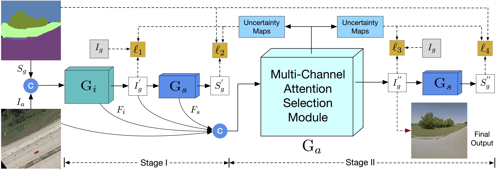
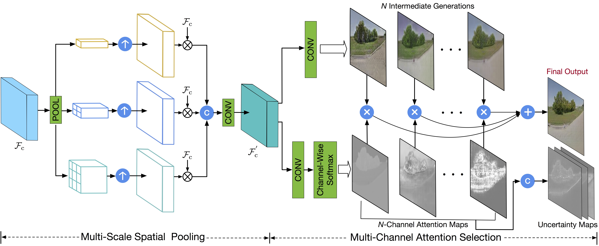

[](https://github.com/Ha0Tang/SelectionGAN/blob/master/LICENSE.md)


[](https://github.com/Ha0Tang/SelectionGAN/graphs/commit-activity)


<!-- [](https://GitHub.com/Ha0Tang/SelectionGAN/issues/) -->
[](https://paperswithcode.com/sota/cross-view-image-to-image-translation-on-2?p=multi-channel-attention-selection-gan-with)
[](https://paperswithcode.com/sota/cross-view-image-to-image-translation-on-3?p=multi-channel-attention-selection-gan-with)
[](https://paperswithcode.com/sota/cross-view-image-to-image-translation-on?p=multi-channel-attention-selection-gan-with)
[](https://paperswithcode.com/sota/cross-view-image-to-image-translation-on-1?p=multi-channel-attention-selection-gan-with)
[](https://paperswithcode.com/sota/cross-view-image-to-image-translation-on-4?p=multi-channel-attention-selection-gan-with)
[](https://paperswithcode.com/sota/cross-view-image-to-image-translation-on-5?p=multi-channel-attention-selection-gan-with)


# SelectionGAN for Cross-View Image Translation

## SelectionGAN Framework


## Multi-Channel Attention Selection Module


## Oral Presentation Video (click image to play)
[](https://youtu.be/9GR8V-VR4Qg?t=3389)

### [Project page](http://disi.unitn.it/~hao.tang/project/SelectionGAN.html) | [Paper](https://arxiv.org/abs/1904.06807) | [Slides](http://disi.unitn.it/~hao.tang/uploads/slides/SelectionGAN_CVPR19.pptx) | [Video](http://disi.unitn.it/~hao.tang/uploads/videos/SelectionGAN_CVPR19.mp4) | [Poster](http://disi.unitn.it/~hao.tang/uploads/posters/SelectionGAN_CVPR19.pdf)

Multi-Channel Attention Selection GAN with Cascaded Semantic Guidancefor Cross-View Image Translation.<br>
[Hao Tang](http://disi.unitn.it/~hao.tang/)<sup>1,2*</sup>,  [Dan Xu](http://www.robots.ox.ac.uk/~danxu/)<sup>3*</sup>, [Nicu Sebe](http://disi.unitn.it/~sebe/)<sup>1,4</sup>, [Yanzhi Wang](https://ywang393.expressions.syr.edu/)<sup>5</sup>, [Jason J. Corso](http://web.eecs.umich.edu/~jjcorso/)<sup>6</sup> and [Yan Yan](https://userweb.cs.txstate.edu/~y_y34/)<sup>2</sup>. (* Equal Contribution.)<br> 
<sup>1</sup>University of Trento, Italy, <sup>2</sup>Texas State University, USA, <sup>3</sup>University of Oxford, UK, 
<sup>4</sup>Huawei Technologies Ireland, Ireland, <sup>5</sup>Northeastern University, USA, <sup>6</sup>University of Michigan, USA   
In [CVPR 2019](http://cvpr2019.thecvf.com/) (Oral).
<br>
The repository offers the official implementation of our paper in PyTorch.


Given an image and some novel semantic maps, SelectionGAN is able to generate the same scene image but with different viewpoints.

### [License](./LICENSE.md)

Copyright (C) 2019 University of Trento, Italy and Texas State University, USA.

All rights reserved.
Licensed under the [CC BY-NC-SA 4.0](https://creativecommons.org/licenses/by-nc-sa/4.0/legalcode) (**Attribution-NonCommercial-ShareAlike 4.0 International**)

The code is released for academic research use only. For commercial use, please contact [hao.tang@unitn.it](hao.tang@unitn.it).

## Installation

Clone this repo.
```bash
git clone https://github.com/Ha0Tang/SelectionGAN
cd SelectionGAN/
```

This code requires PyTorch 0.4.1 and python 3.6+. Please install dependencies by
```bash
pip install -r requirements.txt (for pip users)
```
or 

```bash
./scripts/conda_deps.sh (for Conda users)
```

To reproduce the results reported in the paper, you would need an NVIDIA GeForce GTX 1080 Ti GPU with 11GB memory.

## Dataset Preparation

For Dayton, CVUSA or Ego2Top, the datasets must be downloaded beforehand. Please download them on the respective webpages. In addition, we put a few sample images in this [code repo](https://github.com/Ha0Tang/SelectionGAN/tree/master/datasets/samples). Please cite their papers if you use the data. 

**Preparing Ablation Dataset**. We conduct ablation study in a2g (aerialto-ground) direction on Dayton dataset. To reduce the
training time, we randomly select 1/3 samples from the whole 55,000/21,048 samples i.e. around 18,334 samples for training and 7,017 samples for testing. The trianing and testing splits can be downloaded [here](https://github.com/Ha0Tang/SelectionGAN/tree/master/datasets/dayton_ablation_split).

**Preparing Dayton Dataset**. The dataset can be downloaded [here](https://github.com/lugiavn/gt-crossview). In particular, you will need to download dayton.zip. 
Ground Truth semantic maps are not available for this datasets. We adopt [RefineNet](https://github.com/guosheng/refinenet) trained on CityScapes dataset for generating semantic maps and use them as training data in our experiments. Please cite their papers if you use this dataset.
Train/Test splits for Dayton dataset can be downloaded from [here](https://github.com/Ha0Tang/SelectionGAN/tree/master/datasets/dayton_split).

**Preparing CVUSA Dataset**. The dataset can be downloaded [here](https://drive.google.com/drive/folders/0BzvmHzyo_zCAX3I4VG1mWnhmcGc), which is from the [page](http://cs.uky.edu/~jacobs/datasets/cvusa/). After unzipping the dataset, prepare the training and testing data as discussed in [our paper](https://arxiv.org/abs/1904.06807). We also convert semantic maps to the color ones by using this [script](https://github.com/Ha0Tang/SelectionGAN/blob/master/scripts/convert_semantic_map_cvusa.m).
Since there is no semantic maps for the aerial images on this dataset, we use black images as aerial semantic maps for placehold purposes.

**Preparing Ego2Top Dataset**. The dataset can be downloaded [here](https://www.dropbox.com/sh/bm5g0lzat60td6q/AABQYt-EsIae9ChVR--0Zvo8a?dl=0), which is from this [paper](https://sites.google.com/view/shervinardeshir). We further adopt [this tool](https://github.com/CSAILVision/semantic-segmentation-pytorch) to generate the sematic maps for training. The trianing and testing splits can be downloaded [here](https://github.com/Ha0Tang/SelectionGAN/tree/master/datasets/ego2top_split). 

**Download Dataset**. For your convenience we also provide download scripts:
```
bash ./datasets/download_selectiongan_dataset.sh dayton
```
- `dayton_ablation`: 5.7 GB
- `dayton`: 17.0 GB
- `cvusa`: 1.3 GB
- `ego2top`: 104.0 GB
- `sva`: 14.1 GB

**Preparing Your Own Datasets**. Each training sample in the dataset will contain {Ia,Ig,Sa,Sg}, where Ia=aerial image, Ig=ground image, Sa=semantic map for aerial image and Sg=semantic map for ground image.
Of course, you can use SelectionGAN for your own datasets and tasks.

## Generating Images Using Pretrained Model

Once the dataset is ready. The result images can be generated using pretrained models.

1. You can download a pretrained model (e.g. cvusa) with the following script:

```
bash ./scripts/download_selectiongan_model.sh cvusa
```
The pretrained model is saved at `./checkpoints/[type]_pretrained`. Check [here](https://github.com/Ha0Tang/SelectionGAN/blob/master/scripts/download_selectiongan_model.sh) for all the available SelectionGAN models.

2. Generate images using the pretrained model.
```bash
python test.py --dataroot [path_to_dataset] \
	--name [type]_pretrained \
	--model selectiongan \
	--which_model_netG unet_256 \
	--which_direction AtoB \
	--dataset_mode aligned \
	--norm batch \
	--gpu_ids 0 \
	--batchSize [BS] \
	--loadSize [LS] \
	--fineSize [FS] \
	--no_flip \
	--eval
```
`[path_to_dataset]`, is the path to the dataset. Dataset can be one of `dayton`, `cvusa`, and `ego2top`. `[type]_pretrained` is the directory name of the checkpoint file downloaded in Step 1, which should be one of `dayton_a2g_64_pretrained`, `dayton_g2a_64_pretrained`, `dayton_a2g_256_pretrained`, `dayton_g2a_256_pretrained`, `cvusa_pretrained`,and `ego2top_pretrained`. If you are running on CPU mode, change `--gpu_ids 0` to `--gpu_ids -1`. For [`BS`, `LS`, `FS`],

- `dayton_a2g_64_pretrained`: [16,72,64]
- `dayton_g2a_64_pretrained`: [16,72,64]
- `dayton_g2a_256_pretrained`: [4,286,256]
- `dayton_g2a_256_pretrained`: [4,286,256]
- `cvusa_pretrained`: [4,286,256]
- `ego2top_pretrained`: [8,286,256]

Note that testing require large amount of disk space, because the model will generate 10 intermedia image results and 10 attention maps on disk. If you don't have enough space, append `--saveDisk` on the command line.

    
3. The outputs images are stored at `./results/[type]_pretrained/` by default. You can view them using the autogenerated HTML file in the directory.

## Training New Models

New models can be trained with the following commands.

1. Prepare dataset. 

2. Train.

```bash
# To train on the dayton dataset on 64*64 resolution,

python train.py --dataroot [path_to_dayton_dataset] \
	--name [experiment_name] \
	--model selectiongan \
	--which_model_netG unet_256 \
	--which_direction AtoB \
	--dataset_mode aligned \
	--norm batch \
	--gpu_ids 0 \
	--batchSize 16 \
	--niter 50 \
	--niter_decay 50 \
	--loadSize 72 \
	--fineSize 64 \
	--no_flip \
	--lambda_L1 100 \
	--lambda_L1_seg 1 \
	--display_winsize 64 \
	--display_id 0
```
```bash
# To train on the datasets on 256*256 resolution,

python train.py --dataroot [path_to_dataset] \
	--name [experiment_name] \
	--model selectiongan \
	--which_model_netG unet_256 \
	--which_direction AtoB \
	--dataset_mode aligned \
	--norm batch \
	--gpu_ids 0 \
	--batchSize [BS] \
	--loadSize [LS] \
	--fineSize [FS] \
	--no_flip \
	--display_id 0 \
	--lambda_L1 100 \
	--lambda_L1_seg 1
```
- For dayton dataset, [`BS`,`LS`,`FS`]=[4,286,256], append `--niter 20 --niter_decay 15`.
- For cvusa dataset, [`BS`,`LS`,`FS`]=[4,286,256], append `--niter 15 --niter_decay 15`.
- For ego2top dataset, [`BS`,`LS`,`FS`]=[8,286,256], append `--niter 5 --niter_decay 5`.

There are many options you can specify. Please use `python train.py --help`. The specified options are printed to the console. To specify the number of GPUs to utilize, use `export CUDA_VISIBLE_DEVICES=[GPU_ID]`. Training will cost about one week with the default `--batchSize` on one NVIDIA GeForce GTX 1080 Ti GPU. So we suggest you use a larger `--batchSize`, while performance is not tested using a larger `--batchSize`.

To view training results and loss plots on local computers, set `--display_id` to a non-zero value and run `python -m visdom.server` on a new terminal and click the URL [http://localhost:8097](http://localhost:8097/).
On a remote server, replace `localhost` with your server's name, such as [http://server.trento.cs.edu:8097](http://server.trento.cs.edu:8097).

### Can I continue/resume my training? 
To fine-tune a pre-trained model, or resume the previous training, use the `--continue_train --which_epoch <int> --epoch_count <int+1>` flag. The program will then load the model based on epoch `<int>` you set in `--which_epoch <int>`. Set `--epoch_count <int+1>` to specify a different starting epoch count.


## Testing

Testing is similar to testing pretrained models.

```bash
python test.py --dataroot [path_to_dataset] \
	--name [type]_pretrained \
	--model selectiongan \
	--which_model_netG unet_256 \
	--which_direction AtoB \
	--dataset_mode aligned \
	--norm batch \
	--gpu_ids 0 \
	--batchSize [BS] \
	--loadSize [LS] \
	--fineSize [FS] \
	--no_flip \
	--eval
```

Use `--how_many` to specify the maximum number of images to generate. By default, it loads the latest checkpoint. It can be changed using `--which_epoch`.

## Code Structure

- `train.py`, `test.py`: the entry point for training and testing.
- `models/selectiongan_model.py`: creates the networks, and compute the losses.
- `models/networks/`: defines the architecture of all models for SelectionGAN.
- `options/`: creates option lists using `argparse` package. More individuals are dynamically added in other files as well.
- `data/`: defines the class for loading images and semantic maps.
- `scripts/evaluation`: several evaluation source codes.

## Evaluation Code

We use several metrics to evaluate the quality of the generated images.

- Inception Score: [IS](https://github.com/Ha0Tang/SelectionGAN/blob/master/scripts/evaluation/compute_topK_KL.py), need install `python 2.7`
- Top-k prediction accuracy: [Acc](https://github.com/Ha0Tang/SelectionGAN/blob/master/scripts/evaluation/compute_accuracies.py), need install `python 2.7`
- KL score: [KL](https://github.com/Ha0Tang/SelectionGAN/blob/master/scripts/evaluation/KL_model_data.py), need install `python 2.7`
- Structural-Similarity: [SSIM](https://github.com/Ha0Tang/SelectionGAN/blob/master/scripts/evaluation/compute_ssim_psnr_sharpness.lua), need install `Lua`
- Peak Signal-to-Noise Radio: [PSNR](https://github.com/Ha0Tang/SelectionGAN/blob/master/scripts/evaluation/compute_ssim_psnr_sharpness.lua), need install `Lua`
- Sharpness Difference: [SD](https://github.com/Ha0Tang/SelectionGAN/blob/master/scripts/evaluation/compute_ssim_psnr_sharpness.lua), need install `Lua`
- FID: Official Implementation, [FID](https://github.com/bioinf-jku/TTUR), need install `TF 1.1+ and Python 3.x`

We also provide image IDs used in our paper [here](https://github.com/Ha0Tang/SelectionGAN/blob/master/scripts/Image_ids.txt) for further qualitative comparsion.

## Citation

If you use this code for your research, please cite our papers.
```
@inproceedings{tang2019multichannel,
  title={Multi-Channel Attention Selection GAN with Cascaded Semantic Guidancefor Cross-View Image Translation},
  author={Tang, Hao and Xu, Dan and Sebe, Nicu and Wang, Yanzhi and Corso, Jason J. and Yan, Yan},
  booktitle={Proceedings of the IEEE Conference on Computer Vision and Pattern Recognition (CVPR)},
  year={2019}
}
```

## Acknowledgments
This source code borrows heavily from [Pix2pix](https://github.com/junyanz/pytorch-CycleGAN-and-pix2pix). We thank the authors [X-Fork & X-Seq](https://github.com/kregmi/cross-view-image-synthesis) for providing the evaluation codes. This research was partially supported by National Institute of Standards and Technology Grant 60NANB17D191 (YY, JC), Army Research Office W911NF-15-1-0354 (JC) and gift donation from Cisco Inc (YY).

## Related Projects
- [X-Seq & X-Fork (CVPR 2018, Torch)](https://github.com/kregmi/cross-view-image-synthesis)
- [Pix2pix (CVPR 2017, PyTorch)](https://github.com/junyanz/pytorch-CycleGAN-and-pix2pix): [code]()
- [CrossNet (CVPR 2017, Tensorflow)](https://github.com/viibridges/crossnet):
- [GestureGAN (ACM MM 2018, PyTorch)](https://github.com/Ha0Tang/GestureGAN):

## To Do List
- [x] SelectionGAN
- [ ] SelectionGAN++
- [ ] Pix2pix++: takes RGB image and target semantic map as inputs
- [ ] X-ForK++: takes RGB image and target semantic map as inputs
- [ ] X-Seq++: takes RGB image and target semantic map as inputs

## Contributions
If you have any questions/comments/bug reports, feel free to open a github issue or pull a request or e-mail to the author Hao Tang ([hao.tang@unitn.it](hao.tang@unitn.it)).
